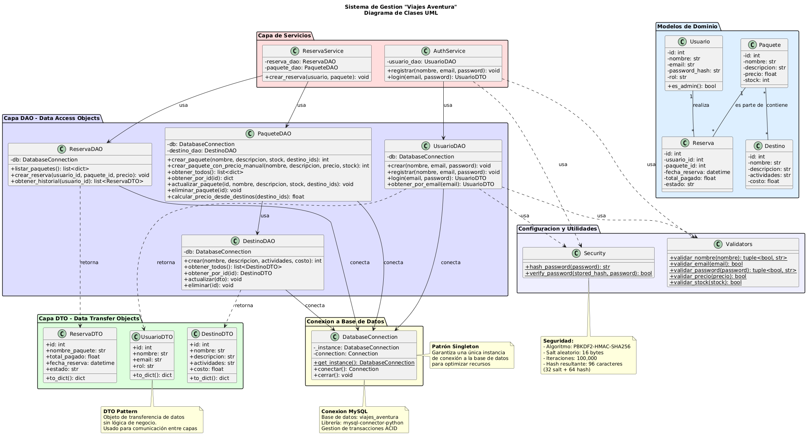
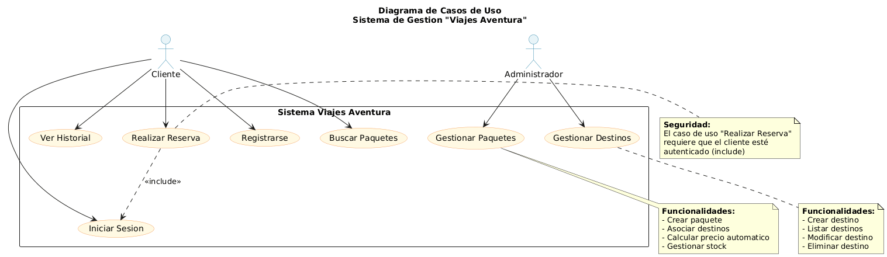
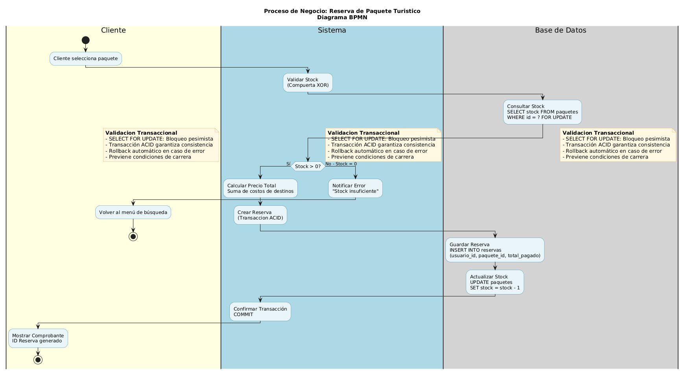

# enlace del repositorio

https://github.com/vngerus/viajes_aventura

# tablero Kanban

https://github.com/users/vngerus/projects/9

# Sistema de Gestion "Viajes Aventura"

Sistema de gestion de reservas turisticas desarrollado en Python para la agencia de viajes "Viajes Aventura". El sistema permite gestionar destinos, paquetes turisticos y reservas, con autenticacion segura y persistencia en base de datos MySQL.

## Instrucciones - Configurar y Ejecutar la App

### Requisitos Previos

Antes de comenzar, asegúrate de tener instalado:

- **Python 3.8 o superior**: Verificar con `python --version`
- **MySQL Server**: Verificar con `mysql --version`
- **Git Bash** (o terminal bash compatible)

**Verificar instalaciones:**
```bash
python --version
mysql --version
```

### 1. Crear y activar el entorno virtual

```bash
python -m venv venv
source venv/Scripts/activate
```

**Verificar que el venv está activo:**
- Deberías ver `(venv)` al inicio de la línea de comandos
- Verificar con: `python -c "import sys; print(sys.executable)"`

### 2. Instalar dependencias

**IMPORTANTE:** Asegúrate de que el venv esté activo antes de instalar.

```bash
python -m pip install --upgrade pip
python -m pip install -r requirements.txt
```

**Verificar instalación:**
```bash
python -c "import mysql.connector; print('mysql-connector-python instalado')"
python -c "import dotenv; print('python-dotenv instalado')"
```

### 3. Configurar variables de entorno

Crear archivo `.env` en la raíz del proyecto:

```bash
cat > .env << EOF
DB_HOST=localhost
DB_USER=root
DB_PASS=tu_contraseña
DB_NAME=viajes_aventura
EOF
```

**O crear manualmente:** Crear archivo `.env` en la raíz con:
```env
DB_HOST=localhost
DB_USER=root
DB_PASS=tu_contraseña
DB_NAME=viajes_aventura
```

**Nota:** Si tu MySQL no tiene contraseña, deja `DB_PASS=` vacío.

### 4. Inicializar la base de datos

**IMPORTANTE:** Asegúrate de que:
- El venv esté activo (deberías ver `(venv)` en la terminal)
- MySQL esté corriendo y accesible
- El archivo `.env` esté configurado correctamente con tus credenciales de MySQL

**Verificar que MySQL esté corriendo:**
```bash
mysql --version
# Si no funciona, verifica que el servicio MySQL esté iniciado
```

**Inicializar la base de datos:**
```bash
python SCRIPTS/setup_database.py
```

**Salida esperada:**
```
 Inicializando sistema...
 Ejecutando script: BDD\init_db.sql
Base de datos y tablas verificadas
Usuario administrador creado
Sistema inicializado correctamente
```

**Si hay errores:**
- Verifica que MySQL esté corriendo: `mysql --version`
- Verifica las credenciales en `.env` (usuario y contraseña correctos)
- Asegúrate de que el venv esté activo
- Si MySQL tiene contraseña, asegúrate de ponerla en `DB_PASS=` del archivo `.env`

### 5. Ejecutar la aplicación

```bash
python main.py
```

### Credenciales por Defecto

- **Admin**: `admin@viajes.com` / `admin123`
- **Cliente**: Registrarse desde el menu principal

## Diagrama de Clases UML

<details>
<summary><strong>Ver Diagrama</strong></summary>



</details>

El diagrama muestra la arquitectura del sistema con:

- **Capa DTO**: Objetos de transferencia de datos (UsuarioDTO, DestinoDTO, ReservaDTO)
- **Capa DAO**: Objetos de acceso a datos (UsuarioDAO, DestinoDAO, PaqueteDAO, ReservaDAO)
- **Capa Services**: Logica de negocio (AuthService, ReservaService)
- **Seguridad**: Hash con PBKDF2-HMAC-SHA256
- **Relaciones**: Asociaciones entre Usuario-Reserva (1:N), Paquete-Reserva (1:N) y Paquete-Destino (N:M)

## Diagrama de Casos de Uso

<details>
<summary><strong>Ver Diagrama</strong></summary>



</details>

## Diagrama BPMN - Proceso de Reserva

<details>
<summary><strong>Ver Diagrama</strong></summary>



</details>

## Cumplimiento de la Pauta

<details>
<summary><strong>4.1.1 Identificacion de Requerimientos</strong></summary>

### Analisis Profundo de la Problematica

- Identificacion de necesidad de gestionar destinos turisticos, paquetes y reservas
- Requisitos funcionales: CRUD de destinos, CRUD de paquetes, sistema de reservas, autenticacion
- Requisitos no funcionales: Seguridad en autenticacion, integridad de datos, validacion de stock

### Pertinencia y Relevancia de los Requerimientos

- **Must Have**: CRUD completo de destinos y paquetes, autenticacion segura, persistencia en BD
- **Should Have**: Calculo automatico de precios, validacion transaccional de stock
- **Could Have**: Historial de reservas para clientes

</details>

<details>
<summary><strong>4.1.2 Diagramas UML</strong></summary>

### Precision en la Representacion de Clases

- **Diagrama**: `docs/diagrama_clases.puml` - Diagrama completo del sistema
- **Imagen**: `docs/Diagrama_Clases_UML.png` - Visualizacion en formato PNG
- **Herramienta**: PlantUML - Estandar UML con notacion correcta

### Cumplimiento de la Notacion UML

- **Notacion correcta**: Uso de `+` para publico, `-` para privado, `__` para separadores
- **Relaciones**: Herencia, dependencias, asociaciones correctamente representadas
- **Paquetes**: Organizacion por capas con colores distintivos

### Diagrama de Casos de Uso

- **Diagrama**: `docs/diagrama_casos_uso.puml` - Casos de uso del sistema
- **Imagen**: `docs/Diagrama_Caso_de_Uso.png` - Visualizacion en formato PNG
- **Actores**: Administrador y Cliente claramente definidos

</details>

<details>
<summary><strong>4.1.3 Procesos de Negocio BPMN</strong></summary>

### Comprension de los Procesos de Negocios con BPMN

- **Diagrama**: `docs/diagrama_bpmn_reserva.puml` - Proceso de reserva de paquete
- **Imagen**: `docs/Diagrama_BPMN.png` - Visualizacion en formato PNG
- **Notacion BPMN**: Uso correcto de actividades, compuertas XOR, swimlanes y notas
- **Proceso detallado**: Validacion de stock, transaccion ACID, actualizacion de inventario

### Coherencia y Consistencia en la Representacion de Procesos

- **Alineacion con requisitos**: El proceso refleja exactamente la implementacion del codigo
- **Transacciones**: Representacion correcta de SELECT FOR UPDATE y control transaccional

</details>

<details>
<summary><strong>4.1.4 Metodologias Agiles</strong></summary>

### Comprension y Aplicacion de Roles del Equipo

- **Metodologia**: Scrum aplicado durante el desarrollo
- **Roles**: Product Owner, Scrum Master, Development Team
- **Asignacion de tareas**: Responsabilidades distribuidas por capas

### Gestion de Plazos de Entrega

- **Sprints**: Iteraciones de 1-2 semanas
- **Product Backlog**: Requerimientos priorizados (Must Have, Should Have, Could Have)
- **Sprint Backlog**: Tareas especificas por iteracion

</details>

<details>
<summary><strong>4.1.5 Implementacion Tecnica</strong></summary>

### Implementacion Efectiva de Autenticacion Segura

- **Algoritmo**: PBKDF2-HMAC-SHA256
- **Implementacion**: `UTILS/security.py` - Funciones `hash_password()` y `verify_password()`
- **Caracteristicas**: Salt aleatorio (16 bytes), 100,000 iteraciones, hash de 96 caracteres
- **Validacion segura**: `DAO/usuario_dao.py` - Metodo `login()` con verificacion de hash

### Conexion Eficiente a la Base de Datos

- **Patron Singleton**: `CONFIG/db.py` - Clase `DatabaseConnection` con instancia unica
- **Libreria**: `mysql-connector-python` para conexion a MySQL
- **Transacciones**: Uso de transacciones ACID para garantizar consistencia

### Metodos CRUD

- **Destinos**: `DAO/destino_dao.py` - CRUD completo
- **Paquetes**: `DAO/paquete_dao.py` - Gestion completa con calculo automatico de precios
- **Reservas**: `DAO/reserva_dao.py` - Creacion de reservas con validacion transaccional
- **Usuarios**: `DAO/usuario_dao.py` - Gestion de usuarios del sistema

### Manejo de Excepciones

- **Bloqueos Try-Catch**: Implementados en todos los metodos DAO
- **Validaciones**: `UTILS/validators.py` - Validacion de entradas (email, password, nombre, precio, stock)

</details>

## Patrones de Diseno Utilizados

### Singleton (DatabaseConnection)

Garantiza una unica instancia de conexion a la base de datos:

```python
from CONFIG.db import DatabaseConnection

db = DatabaseConnection.get_instance()
conn = db.conectar()
```

**Justificacion**: Evita multiples conexiones simultaneas que consumen recursos.

### DAO (Data Access Object)

Separa la logica de acceso a datos de la logica de negocio:

```python
from DAO.destino_dao import DestinoDAO

destino_dao = DestinoDAO()
destino = destino_dao.obtener_por_id(1)
```

### DTO (Data Transfer Object)

Objetos ligeros para transferir datos entre capas sin exponer la estructura interna.

## Base de Datos

### Esquema Relacional

```sql
usuarios (id, nombre, email, password_hash, rol, fecha_registro)
destinos (id, nombre, descripcion, actividades, costo, fecha_creacion)
paquetes (id, nombre, descripcion, precio, stock, fecha_creacion)
paquete_destinos (paquete_id, destino_id, orden)  -- Relacion N:M
reservas (id, usuario_id, paquete_id, fecha_reserva, total_pagado, estado)
```

### Integridad Referencial

- **Foreign Keys**: Todas las relaciones estan protegidas con claves foraneas
- **CASCADE**: Eliminar un usuario elimina sus reservas
- **RESTRICT**: No se puede eliminar un destino asociado a un paquete
- **Transacciones**: Las reservas usan transacciones para garantizar consistencia

## Funcionalidades Principales

### Para Administradores

- **Gestion de Destinos**: CRUD completo de destinos turisticos
- **Gestion de Paquetes**: Crear paquetes con calculo automatico de precios basado en destinos

### Para Clientes

- **Registro y Autenticacion**: Sistema seguro de registro y login
- **Reservas**: Ver paquetes disponibles y realizar reservas con validacion de stock
- **Historial**: Ver historial de reservas propias

## Calculo Automatico de Precios

Cuando se crea un paquete seleccionando destinos, el precio se calcula automaticamente sumando los costos de los destinos incluidos.

## Estructura de Archivos

```
viajes_aventura/
├── BDD/                      # Scripts de base de datos
│   └── init_db.sql           # Esquema relacional
├── CONFIG/                   # Configuracion
│   └── db.py                 # Singleton para conexion BD
├── DAO/                      # Data Access Object
│   ├── destino_dao.py
│   ├── paquete_dao.py
│   ├── reserva_dao.py
│   └── usuario_dao.py
├── DTO/                      # Data Transfer Object
│   ├── destino_dto.py
│   ├── reserva_dto.py
│   └── usuario_dto.py
├── MODELS/                   # Modelos de dominio
│   ├── destino.py
│   ├── paquete.py
│   └── usuario.py
├── SERVICES/                 # Logica de negocio
│   ├── auth_service.py
│   └── reserva_service.py
├── UTILS/                    # Utilidades
│   ├── security.py           # Hashing y seguridad
│   └── validators.py         # Validaciones
├── SCRIPTS/                  # Scripts auxiliares
│   ├── setup_database.py     # Inicializacion BD
│   └── recrear_admin.py      # Recrear usuario admin
├── docs/                     # Documentacion
│   ├── diagrama_clases.puml
│   ├── diagrama_casos_uso.puml
│   ├── diagrama_bpmn_reserva.puml
│   └── generar_diagramas.py
└── main.py                   # Punto de entrada
```

## Solucion de Problemas

### Error: "ModuleNotFoundError: No module named 'mysql'"

**Causa:** El venv no está activo o las dependencias no están instaladas.

**Solución:**
```bash
source venv/Scripts/activate
python -m pip install -r requirements.txt
python -c "import mysql.connector; print('OK')"
```

### Error: "Access denied for user"

**Causa:** Credenciales incorrectas o MySQL no está corriendo.

**Solución:**
1. Verificar que MySQL esté corriendo: `mysql --version`
2. Verificar credenciales en `.env`:
   - `DB_USER` debe ser un usuario válido de MySQL (generalmente `root`)
   - `DB_PASS` debe ser la contraseña correcta (o vacío si no tiene)
3. Probar conexión manual:
   ```bash
   mysql -u root -p
   ```

### Error: "Table doesn't exist"

**Causa:** La base de datos no ha sido inicializada.

**Solución:**
```bash
source venv/Scripts/activate
python SCRIPTS/setup_database.py
```

### Error: "Too many connections"

**Causa:** Múltiples conexiones abiertas simultáneamente.

**Solución:**
- Cerrar todas las instancias de la aplicación
- Verificar que se esté usando el patrón Singleton correctamente
- Reiniciar MySQL si es necesario

### Error: "Credenciales invalidas" al iniciar sesion

**Causa:** El usuario admin no existe o la contraseña fue cambiada.

**Solución:**
```bash
source venv/Scripts/activate
python SCRIPTS/recrear_admin.py
```

**Credenciales por defecto del admin:**
- Email: `admin@viajes.com`
- Contraseña: `admin123`

### Error al ejecutar `source venv/Scripts/activate`

**Causa:** Ruta incorrecta o venv no creado.

**Solución:**
```bash
ls -la venv/Scripts/
python -m venv venv
source venv/Scripts/activate
```

## Generar Diagramas

Para generar los diagramas UML y BPMN:

```bash
python docs/generar_diagramas.py
```

O usar el servidor web de PlantUML: http://www.plantuml.com/plantuml/uml/

## Autores

- **Equipo de Desarrollo**: Á. S.
- **Docente**: Maria del Pilar Gallego Martinez
- **Asignatura**: Programacion Orientada a Objeto Seguro
- **Carrera**: Analista Programador
